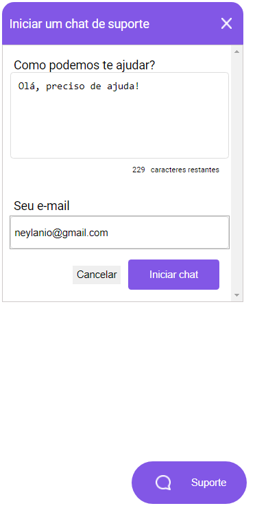

# Back-end Chat bot

## __Techs__

> * ### NodeJS
> * ### Typescript
> * ### ExpressJS
> * ### Web Socket

### Socket.io lib
* ### https://github.com/socketio/socket.io

## __Commands__

> * ### npm i
> * ### npm run dev

## __Images__
<figure>
    
</figure>  
